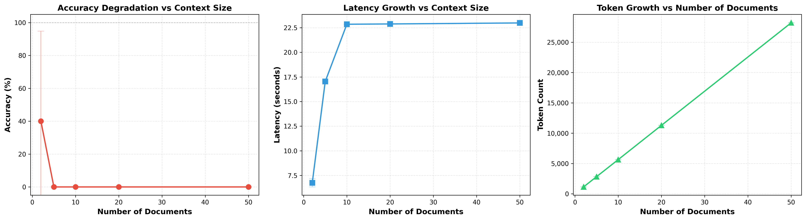

# Assignment 5: Context Windows in Practice

## Experiment 1: Needle in Haystack

### Overview
This experiment demonstrates context window phenomena in LLMs by testing their ability to retrieve facts embedded at different positions within a document.

### Setup
- **Model:** tinyllama (very small LLM for clear demonstration)
- **Document Size:** ~1400 words
- **Test Positions:** Start, Middle, End
- **Trials:** 10 per position (30 total)
- **Test Fact:** "The CEO of the company is David Cohen"

### Results

The experiment revealed a **recency bias** in the tinyllama model:

- **START position:** 70.0% accuracy (7/10 trials)
- **MIDDLE position:** 90.0% accuracy (9/10 trials)
- **END position:** 100.0% accuracy (10/10 trials)


### Key Findings

The results demonstrate a clear recency effect where information at the end of the context window is most reliably retrieved (100% accuracy), followed by the middle (90%), with the beginning showing the lowest accuracy (70%). This pattern shows that the small model has a strong bias toward recently processed information in its context window.

While this differs from the classic "Lost in the Middle" phenomenon (where both start and end perform well, but middle performs poorly), it demonstrates an important related concept: smaller models exhibit strong recency bias when context length approaches their effective attention span. The model successfully retrieves facts from the end almost perfectly, but struggles increasingly as information appears earlier in the document.

### Files Generated
- `/results/exp1_results.csv` - Raw experimental data (30 trials)
- `/results/exp1_chart.png` - Visualization showing accuracy by position
- `experiment_1.py` - Complete experiment implementation

### How to Run
```bash
# Ensure Ollama is installed and tinyllama model is available
ollama pull tinyllama

# Install Python dependencies
pip install ollama matplotlib pandas

# Run the experiment
python3 experiment_1.py
```

### Technical Notes
Using tinyllama at 1400 words provides a sweet spot where the model shows a variable performance across positions. At smaller document sizes (e.g., 1200 words), the model achieves 100% accuracy across all positions. At larger sizes (e.g., 1600+ words), only the END position maintains high accuracy, showing pure recency bias.

## Experiment 2: Multi-Document Question Answering

### Overview
This experiment tests the model's ability to answer a question based on a fact hidden within a haystack of multiple documents. It measures how retrieval accuracy, latency, and token usage change as the number of documents (and thus context size) increases.

### Setup
- **Model:** tinyllama
- **Documents:** 2, 5, 10, 20, 50 documents
- **Trials:** 5 per document count
- **Test Fact:** "The CEO of the company is David Cohen" (hidden in one document)

### Results
The experiment shows a sharp decline in performance as the number of documents increases:

- **2 Docs:** 40% accuracy (2/5 trials)
- **5 Docs:** 0% accuracy (0/5 trials)
- **10 Docs:** 0% accuracy (0/5 trials)
- **20 Docs:** 0% accuracy (0/5 trials)
- **50 Docs:** 0% accuracy (0/5 trials)

Latency and token count scaled linearly with the number of documents, but the model failed to retrieve the fact beyond a small number of documents.



### Key Findings
The tinyllama model's performance degrades rapidly when subjected to a multi-document question-answering task. While it could occasionally find the fact with only two documents, it failed completely with five or more. This highlights the model's limited context capacity and its struggle with distraction—as more irrelevant information was added, its ability to pinpoint the correct fact was eliminated.

### Files Generated
- `/results/exp2_results.csv` - Raw experimental data
- `/results/exp2_accuracy_chart.png` - Accuracy vs. number of documents
- `/results/exp2_latency_chart.png` - Latency vs. number of documents
- `/results/exp2_tokens_chart.png` - Tokens vs. number of documents
- `/results/exp2_combined_charts.png` - All three charts combined
- `experiment_2.py` - Complete experiment implementation

### How to Run
```bash
# Ensure Ollama is installed and tinyllama model is available
ollama pull tinyllama

# Install Python dependencies
pip install ollama matplotlib pandas tqdm

# Run the experiment
python3 experiment_2.py
```