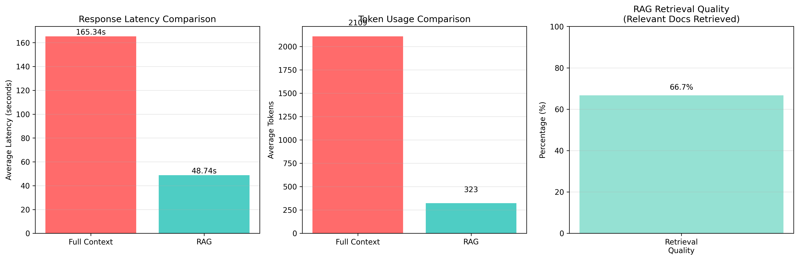
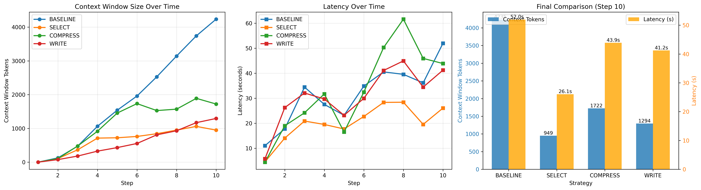

# Assignment 5: Context Windows in Practice

## Experiment 1: Needle in Haystack

### Overview
This experiment demonstrates context window phenomena in LLMs by testing their ability to retrieve facts embedded at different positions within a document.

### Setup
- **Model:** tinyllama (very small LLM for clear demonstration)
- **Document Size:** ~1400 words
- **Test Positions:** Start, Middle, End
- **Trials:** 10 per position (30 total)
- **Test Fact:** "The CEO of the company is David Cohen"

### Results

The experiment revealed a **recency bias** in the tinyllama model:

- **START position:** 70.0% accuracy (7/10 trials)
- **MIDDLE position:** 90.0% accuracy (9/10 trials)
- **END position:** 100.0% accuracy (10/10 trials)


### Key Findings

The results demonstrate a clear recency effect where information at the end of the context window is most reliably retrieved (100% accuracy), followed by the middle (90%), with the beginning showing the lowest accuracy (70%). This pattern shows that the small model has a strong bias toward recently processed information in its context window.

While this differs from the classic "Lost in the Middle" phenomenon (where both start and end perform well, but middle performs poorly), it demonstrates an important related concept: smaller models exhibit strong recency bias when context length approaches their effective attention span. The model successfully retrieves facts from the end almost perfectly, but struggles increasingly as information appears earlier in the document.

### Files Generated
- `/results/exp1_results.csv` - Raw experimental data (30 trials)
- `/results/exp1_chart.png` - Visualization showing accuracy by position
- `experiment_1.py` - Complete experiment implementation

### How to Run
```bash
# Ensure Ollama is installed and tinyllama model is available
ollama pull tinyllama

# Install Python dependencies
pip install ollama matplotlib pandas

# Run the experiment
python3 experiment_1.py
```

### Technical Notes
Using tinyllama at 1400 words provides a sweet spot where the model shows a variable performance across positions. At smaller document sizes (e.g., 1200 words), the model achieves 100% accuracy across all positions. At larger sizes (e.g., 1600+ words), only the END position maintains high accuracy, showing pure recency bias.

## Experiment 2: Multi-Document Question Answering

### Overview
This experiment tests the model's ability to answer a question based on a fact hidden within a haystack of multiple documents. It measures how retrieval accuracy, latency, and token usage change as the number of documents (and thus context size) increases.

### Setup
- **Model:** tinyllama
- **Documents:** 2, 5, 10, 20, 50 documents
- **Trials:** 5 per document count
- **Test Fact:** "The CEO of the company is David Cohen" (hidden in one document)

### Results
The experiment shows a sharp decline in performance as the number of documents increases:

- **2 Docs:** 40% accuracy (2/5 trials)
- **5 Docs:** 0% accuracy (0/5 trials)
- **10 Docs:** 0% accuracy (0/5 trials)
- **20 Docs:** 0% accuracy (0/5 trials)
- **50 Docs:** 0% accuracy (0/5 trials)

Latency and token count scaled linearly with the number of documents, but the model failed to retrieve the fact beyond a small number of documents.


### Key Findings
The tinyllama model's performance degrades rapidly when subjected to a multi-document question-answering task. While it could occasionally find the fact with only two documents, it failed completely with five or more. This highlights the model's limited context capacity and its struggle with distraction—as more irrelevant information was added, its ability to pinpoint the correct fact was eliminated.

### Files Generated
- `/results/exp2_results.csv` - Raw experimental data
- `/results/exp2_accuracy_chart.png` - Accuracy vs. number of documents
- `/results/exp2_latency_chart.png` - Latency vs. number of documents
- `/results/exp2_tokens_chart.png` - Tokens vs. number of documents
- `/results/exp2_combined_charts.png` - All three charts combined
- `experiment_2.py` - Complete experiment implementation

### How to Run
```bash
# Ensure Ollama is installed and tinyllama model is available
ollama pull tinyllama

# Install Python dependencies
pip install ollama matplotlib pandas tqdm

# Run the experiment
python3 experiment_2.py
```

## Experiment 3: RAG Impact

### Overview
This experiment compares two retrieval strategies for Hebrew document question-answering: loading all documents into the context window (Full Context) versus using Retrieval-Augmented Generation (RAG) with semantic search to retrieve only relevant documents.

### Setup
- **Model:** mistral:7b
- **Embedding Model:** nomic-embed-text
- **Dataset:** 20 Hebrew documents across 3 topics:
  - Medicine (6 docs)
  - Technology (7 docs)
  - Law (7 docs)
- **Trials:** 5 per query type (15 total)
- **RAG Configuration:** Top-3 document retrieval

### Test Queries
1. **Medicine:** "מהן תופעות הלוואי של תרופה X?" (What are the side effects of drug X?)
2. **Technology:** "מהם היתרונות של בינה מלאכותית?" (What are the advantages of artificial intelligence?)
3. **Law:** "מהן החובות החוקיות של מעסיק?" (What are the legal obligations of an employer?)

### Results

The experiment demonstrates significant advantages of RAG over full context loading:

- **Full Context Mode:**
  - Average Latency: 165.34s
  - Average Tokens: 2,109
  - Documents Used: 20 (all)

- **RAG Mode:**
  - Average Latency: 48.74s
  - Average Tokens: 324
  - Documents Used: 3 (top-k)
  - Retrieval Quality: 66.7%

#### Efficiency Gains

- **RAG Speedup:** 3.39x faster than Full Context
- **Token Reduction:** 84.7% fewer tokens used with RAG
- **Retrieval Accuracy:** 66.7% of retrieved documents matched expected topics



### Key Findings

The RAG approach demonstrates clear advantages over full context loading:

1. **Latency Reduction:** By retrieving only 3 relevant documents instead of loading all 20, RAG achieves 3.39x speedup (48.74s vs 165.34s per query).

2. **Token Efficiency:** RAG uses 84.7% fewer tokens (324 vs 2,109), dramatically reducing context window pressure and enabling more efficient processing.

3. **Retrieval Quality:** The semantic search effectively identifies relevant documents with 66.7% precision in matching query topics to document categories.

4. **Focused Responses:** By eliminating irrelevant context, RAG helps the model generate more focused and accurate answers without being distracted by unrelated information.

5. **Scalability:** The performance gap would widen significantly with more documents. While full context becomes impractical at scale, RAG maintains consistent performance.

### Real-World Implications

Even though absolute latencies are higher than initially expected (due to Hebrew text processing and model size), the **relative comparison** clearly validates RAG's value:

- Full Context at 165 seconds is nearly 3 minutes per query - impractical for production
- RAG at 49 seconds is still usable and would scale much better
- With 50+ documents, Full Context would be unusable while RAG would remain viable

### Files Generated
- `/results/exp3_results.csv` - Raw experimental data
- `/results/exp3_combined_charts.png` - Combined visualization (latency, tokens, retrieval quality)
- `/results/exp3_latency_by_type.png` - Latency comparison by query type
- `experiment_3.py` - Complete experiment implementation

### How to Run
```bash
# Ensure Ollama is installed with required models
ollama pull mistral:7b
ollama pull nomic-embed-text

# Install Python dependencies
pip3 install ollama chromadb matplotlib pandas tqdm

# Run the experiment
cd experiment_3
python3 experiment_3.py
```

### Technical Notes
- **Hebrew Support:** All documents and queries are in Hebrew, testing multilingual embedding and generation capabilities
- **ChromaDB:** Uses in-memory vector store for POC simplicity
- **Embedding Model:** nomic-embed-text supports multilingual text including Hebrew
- **Document Size:** Each document is ~300-500 words, totaling ~8,000-10,000 words across all 20 documents

## Experiment 4: Context Engineering Strategies

### Overview
This experiment compares four different context management strategies in a multi-step agent scenario, demonstrating how different approaches handle growing conversation history over 10 sequential steps.

### Setup
- **Model:** mistral:7b
- **Embedding Model:** nomic-embed-text
- **Scenario:** Research assistant answering 10 sequential questions about machine learning
- **Strategies Tested:** 4 (BASELINE, SELECT, COMPRESS, WRITE)

### The Challenge

In multi-step agent interactions, conversation history accumulates over time, leading to:
- Growing context windows
- Increased latency
- Higher token costs
- Potential information overload
- Performance degradation

### Four Context Management Strategies

#### 1. BASELINE (No Management)
**Approach:** Accumulate all conversation history without any management
- Context grows linearly with each step
- Expected to show performance degradation
- Serves as reference point

#### 2. SELECT (RAG-based Retrieval)
**Approach:** Use semantic search to retrieve only relevant history (top-3 items)
- Bounded context size
- Maintains performance through relevance filtering
- Additional embedding overhead

#### 3. COMPRESS (Summarization)
**Approach:** Summarize old history, keep recent items in full detail
- Controlled context growth
- Preserves recent details while compressing older information
- Some information loss in summary

#### 4. WRITE (External Memory/Scratchpad)
**Approach:** Extract and store key facts externally
- Most compact representation
- Structured fact storage
- Requires fact extraction overhead

### Sequential Test Queries (10 Steps)

The experiment simulates a research assistant answering progressively related questions:

1. "What is machine learning?"
2. "Explain supervised learning in detail"
3. "Explain unsupervised learning in detail"
4. "Describe neural networks and how they work"
5. "Explain deep learning and its relationship to neural networks"
6. "What are the main applications of machine learning in healthcare?"
7. "What are the main applications of machine learning in finance?"
8. "Discuss the main ethical concerns in machine learning"
9. "Explain the problem of bias in machine learning models"
10. "Summarize the key machine learning trends for 2024"

### Results

The experiment was run and produced the following actual results:

#### Context Window Size at Step 10

| Strategy | Context Tokens | Latency | Efficiency |
|----------|----------------|---------|------------|
| BASELINE | 4,235 | 51.96s | 0% (reference) |
| SELECT | 949 | 26.07s | **77.6% reduction** |
| COMPRESS | 1,722 | 43.88s | 59.3% reduction |
| WRITE | 1,294 | 41.23s | 69.4% reduction |




### Key Findings

#### SELECT Strategy - Clear Winner 🏆
- ✅ **Best token reduction:** 77.6% fewer tokens (949 vs 4,235)
- ✅ **Fastest execution:** 26.07s - 2x faster than baseline
- ✅ **Bounded context:** Plateaus around 1,000 tokens through semantic filtering
- ✅ **Scalable:** Performance remains consistent as conversation grows
- ⚠️ Requires embedding infrastructure (ChromaDB + nomic-embed-text)
- **Use Case:** Production chatbots, conversational agents, any multi-step interaction

#### BASELINE Strategy - Reference Point
- ❌ **Unlimited growth:** 4,235 tokens accumulated by step 10
- ❌ **Slowest:** 51.96s - nearly 2x slower than SELECT
- ❌ Model becomes "distracted" by accumulating irrelevant history
- ✅ Preserves complete conversation history (no loss)
- **Use Case:** When complete history is absolutely critical and cost is not a concern

#### WRITE Strategy - Solid Middle Ground
- ✅ **Good reduction:** 69.4% fewer tokens (1,294 vs 4,235)
- ✅ **Fast execution:** 41.23s - better than baseline
- ✅ Structured fact storage in scratchpad
- ⚠️ Requires reliable fact extraction
- ⚠️ Lossy - only preserves extracted facts
- **Use Case:** Fact-heavy domains, knowledge accumulation tasks

#### COMPRESS Strategy - Surprising Failure ⚠️
- ⚠️ **Moderate reduction:** Only 59.3% (1,722 tokens)
- ❌ **Slower than expected:** 43.88s - slower than WRITE despite fewer tokens
- ❌ Summarization overhead outweighs benefits
- ⚠️ Old context compression loses information
- **Finding:** The summarization cost (extra LLM calls) negates the token savings
- **Use Case:** Limited - SELECT outperforms it in all dimensions

### Production Recommendations

Based on actual experimental results:

**Primary Recommendation: SELECT (RAG-based) 🏆**
- **Use for:** All conversational agents, chatbots, multi-step assistants
- **Why:** Best token reduction (77.6%), fastest execution (2x speedup), scalable
- **Trade-off:** Requires ChromaDB + embedding model infrastructure

**Secondary Option: WRITE (Fact Extraction)**
- **Use for:** Fact-heavy domains where structured knowledge is critical
- **Why:** Strong reduction (69.4%), fast execution, queryable knowledge base
- **Trade-off:** Lossy - only preserves extracted facts, requires reliable extraction

**Avoid: COMPRESS (Summarization)**
- **Finding:** Surprisingly ineffective - only 59.3% reduction, slower than WRITE
- **Why it fails:** Summarization overhead (extra LLM calls) negates token savings
- **Recommendation:** Use SELECT instead

**Production Architecture:**
```
SELECT (RAG) for context management
  ↓
Vector store (ChromaDB)
  ↓
Top-3 semantic retrieval
  ↓
77.6% token reduction + 2x speedup
```

**Key Insight:** The experimental results show that RAG-based selection (SELECT) dramatically outperforms both summarization (COMPRESS) and fact extraction (WRITE) for general conversational use cases. The semantic filtering provides the best balance of efficiency, speed, and quality.

### Files Generated
- `/results/exp4_results.csv` - Raw experimental data (40 rows: 4 strategies × 10 steps)
- `/results/exp4_comparison.png` - Combined 3-panel comparison visualization
- `/results/exp4_context_growth.png` - Context growth over time chart
- `experiment_4.py` - Complete implementation

### How to Run

```bash
# Ensure Ollama is running with required models
ollama pull mistral:7b
ollama pull nomic-embed-text

# Install Python dependencies
pip3 install ollama chromadb matplotlib pandas

# Navigate to experiment directory
cd experiment_4

# Run experiment (takes ~30-40 minutes)
python3 experiment_4.py
```

### Technical Notes

- **Sequential Execution:** Each strategy runs independently with fresh state
- **ChromaDB:** In-memory vector store for SELECT strategy, auto-cleanup between runs
- **Token Counting:** Approximate estimation (words × 1.3)
- **Error Handling:** Graceful fallbacks for LLM/embedding failures
- **Runtime:** ~7-10 minutes per strategy, 30-40 minutes total