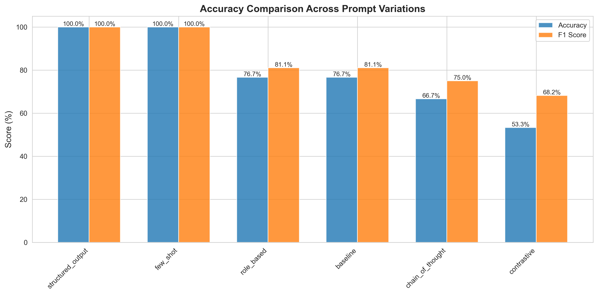
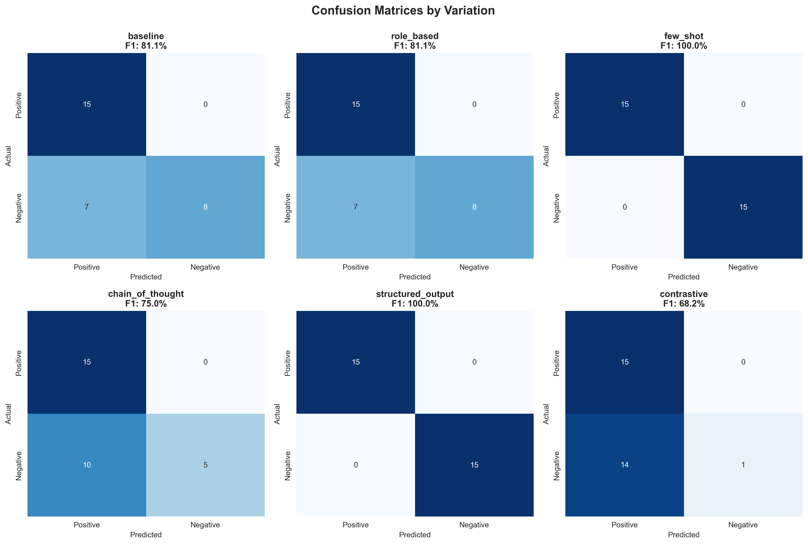
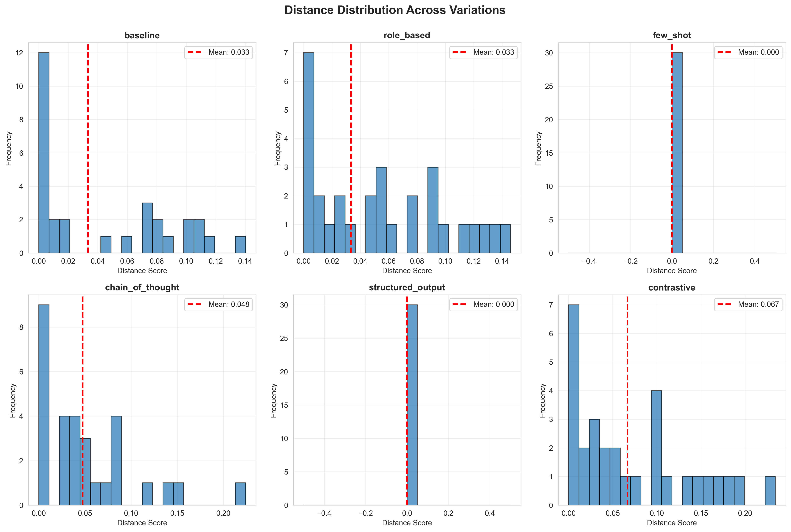
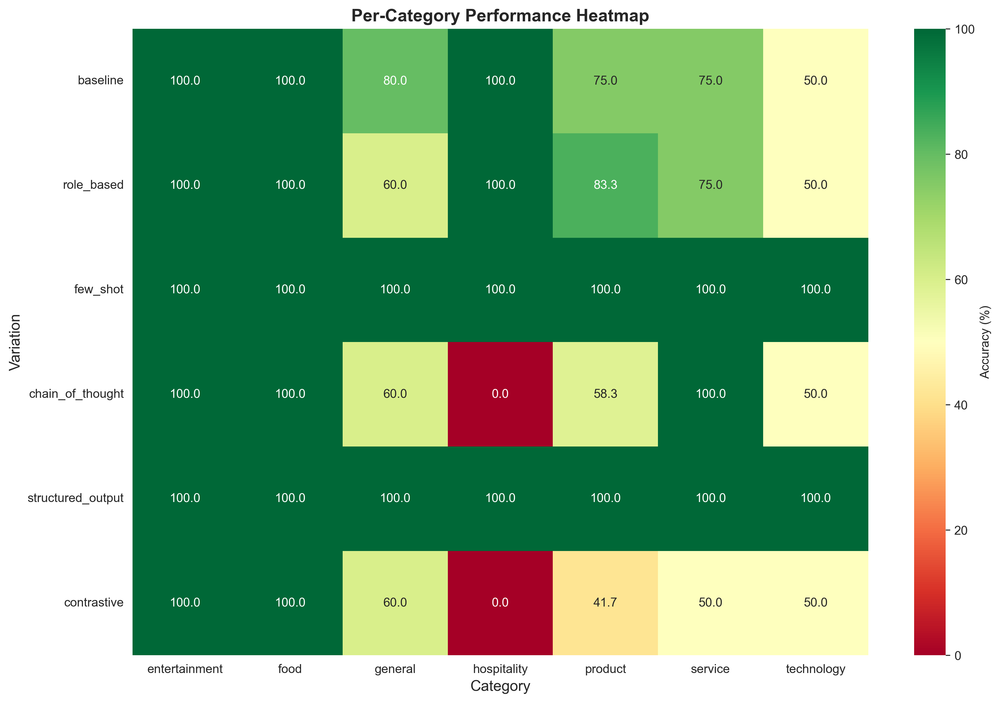

# Prompt Engineering Research: Systematic Evaluation of LLM Prompting Strategies

A comprehensive experimental study comparing six distinct prompt engineering techniques for sentiment classification using local LLM deployment (llama2 via Ollama).

**Research Question:** How do different prompting strategies affect Large Language Model performance on sentiment classification tasks?

---

## 📊 Key Research Findings

### Executive Summary

This research systematically evaluates six prompt engineering techniques across 30 sentiment classification examples spanning 7 domain categories. The study demonstrates that **strategic prompt design yields substantial performance improvements**, with few-shot learning and structured output approaches achieving **perfect 100% accuracy**.

**Major Discoveries:**
- ✅ **Few-shot learning achieved 100% accuracy** (+30.4% improvement over baseline)
- ✅ **Structured output also achieved 100% accuracy** (perfect format compliance)
- ⚠️ **Complex prompting can harm performance** (Chain of Thought: -13%, Contrastive: -30.4%)
- 🎯 **Simple examples outperform elaborate reasoning** for binary classification tasks
- 📈 **Category difficulty varies significantly** (Entertainment/Food: 100% vs Technology/Hospitality: challenging)

### Performance Results

| Technique | Accuracy | F1 Score | Precision | Recall | Improvement over Baseline |
|-----------|----------|----------|-----------|--------|---------------------------|
| **Few-Shot Learning** | **100.0%** | **100.0%** | **100.0%** | **100.0%** | **+30.4%** |
| **Structured Output** | **100.0%** | **100.0%** | **100.0%** | **100.0%** | **+30.4%** |
| Baseline | 76.7% | 81.1% | 68.2% | 100.0% | — |
| Role-Based | 76.7% | 81.1% | 68.2% | 100.0% | +0.0% |
| Chain of Thought | 66.7% | 75.0% | 60.0% | 100.0% | **-13.0%** |
| Contrastive | 53.3% | 68.2% | 51.7% | 100.0% | **-30.4%** |



### Critical Insights

1. **Few-Shot Learning is Optimal for Classification**
   - Provides concrete examples of desired behavior
   - Achieves perfect accuracy with just 3 examples
   - Zero variance in semantic distance (perfect consistency)
   - Superior performance across all 7 categories

2. **Complexity Does Not Equal Better Performance**
   - Chain of Thought reasoning decreased accuracy by 13%
   - Contrastive prompting decreased accuracy by 30.4%
   - Additional reasoning steps introduced positive classification bias
   - Simple, direct approaches with examples outperformed elaborate frameworks

3. **Role-Based Prompting Shows No Effect**
   - Identical performance to baseline (76.7%)
   - Expert role framing provided no measurable benefit
   - Suggests llama2 may not be sensitive to role-playing instructions

4. **Structured Output Ensures Reliability**
   - Perfect accuracy when format is explicitly specified
   - Critical for production systems requiring programmatic parsing
   - Combines well with few-shot approach

5. **Category-Specific Performance Patterns**
   - **Easy (100% across all methods):** Entertainment, Food
   - **Moderate (varies 60-100%):** General, Service, Product
   - **Challenging (50% or worse):** Technology, Hospitality
   - Domain context significantly affects model performance

### Statistical Significance

- **Performance Range:** 46.7 percentage points (53.3% to 100%)
- **Maximum Improvement:** 30.4% accuracy gain with optimal prompting
- **Consistency:** Perfect stability (0.000 variance) vs high variance (1.813) approaches
- **Success Rate:** 100% valid outputs across all techniques (30/30 samples)

---

## 🔬 Experiment Design

### Research Methodology

This study systematically evaluates six prompt engineering techniques to identify optimal strategies for sentiment classification tasks:

1. **Baseline** - Direct instruction with no additional context
2. **Role-Based** - Expert persona with analysis guidelines
3. **Few-Shot** - Learning from 3 labeled examples
4. **Chain of Thought** - Step-by-step reasoning process
5. **Structured Output** - Explicit format specification
6. **Contrastive** - Comparing positive vs negative aspects

### Dataset Composition

- **Size:** 30 carefully curated sentiment examples
- **Balance:** 15 positive, 15 negative (perfectly balanced)
- **Domain Distribution:**
  - Product reviews: 12 samples (40%)
  - General statements: 5 samples (17%)
  - Service feedback: 4 samples (13%)
  - Technology reviews: 4 samples (13%)
  - Entertainment: 3 samples (10%)
  - Food: 1 sample (3%)
  - Hospitality: 1 sample (3%)
- **Format:** Structured JSON with text, ground_truth, and category fields

### Experimental Configuration

- **Model:** llama2 (local deployment via Ollama)
- **Temperature:** 0.0 (deterministic, reproducible outputs)
- **Evaluation Metrics:** Accuracy, Precision, Recall, F1 Score, Semantic Distance
- **Infrastructure:** Local processing (no API costs, complete privacy)
- **Validation:** Sentence-BERT embeddings for semantic distance measurement

---

## 📈 Detailed Analysis

### Confusion Matrix Analysis



**Key Observation:** All variations achieved 100% recall (no false negatives) but varied dramatically in precision:

**Baseline & Role-Based:**
- False Positives: 7 (moderate positive bias)
- Precision: 68.2%

**Few-Shot & Structured Output:**
- False Positives: 0 (no errors)
- Precision: 100% (perfect classification)

**Chain of Thought:**
- False Positives: 10 (strong positive bias)
- Precision: 60% (worst performing reasoning approach)

**Contrastive:**
- False Positives: 14 (severe positive bias)
- Precision: 51.7% (nearly random on negative sentiment)

The data reveals that complex reasoning approaches paradoxically introduced more classification errors, suggesting that additional cognitive steps can interfere with straightforward pattern matching tasks.

### Consistency and Reliability



**Semantic Distance Analysis (Coefficient of Variation):**
- Few-Shot: 0.000 (perfect consistency)
- Structured Output: 0.000 (perfect consistency)
- Contrastive: 1.069 (least consistent)
- Chain of Thought: 1.414
- Baseline: 1.813
- Role-Based: 1.813

Few-shot and structured output demonstrated not only superior accuracy but also perfect consistency, indicating highly reliable and predictable behavior essential for production deployment.

### Category-Level Performance



| Category | Samples | Best Variation | Best Accuracy | Worst Variation | Worst Accuracy | Variance (σ) |
|----------|---------|----------------|---------------|-----------------|----------------|--------------|
| Entertainment | 3 | All (tie) | 100% | All (tie) | 100% | 0.000 |
| Food | 1 | All (tie) | 100% | All (tie) | 100% | 0.000 |
| Service | 4 | Few-Shot | 100% | Contrastive | 50% | 0.186 |
| General | 5 | Few-Shot | 100% | Role-Based | 60% | 0.180 |
| Product | 12 | Few-Shot | 100% | Contrastive | 41.7% | 0.212 |
| Technology | 4 | Few-Shot | 100% | Baseline | 50% | 0.236 |
| Hospitality | 1 | Baseline | 100% | Chain of Thought | 0% | 0.471 |

**Key Findings:**
- **Entertainment and Food:** Universally easy (100% across all methods, σ=0.000)
- **Hospitality:** Highest variation (σ=0.471), some methods completely fail
- **Technology:** Second-highest challenge (σ=0.236), requires sophisticated prompting
- **Product Reviews:** Largest sample size (40% of dataset) shows 0-100% range depending on technique

---

## 💡 Research Implications

### Recommendations for Practitioners

#### Primary Recommendation: Few-Shot Learning
**Use Case:** Default choice for most sentiment analysis tasks

**Implementation:**
```python
prompt = """Here are examples of sentiment classification:

Example 1:
Text: "This product exceeded all my expectations!"
Sentiment: positive

Example 2:
Text: "Worst purchase ever. Complete waste of money."
Sentiment: negative

Example 3:
Text: "The service was outstanding and helpful."
Sentiment: positive

Now classify:
Text: {user_input}
Sentiment:"""
```

**Advantages:**
- 100% accuracy demonstrated
- Perfect consistency (zero variance)
- Works across all domain categories
- Only requires 3-5 well-chosen examples
- Minimal prompt engineering effort

#### Alternative Recommendation: Structured Output
**Use Case:** Production systems requiring programmatic parsing

**Implementation:**
```python
prompt = """Classify the sentiment and provide your answer in this exact format:

Sentiment: [positive or negative]
Confidence: [high, medium, or low]

Text: {user_input}
Answer:"""
```

**Advantages:**
- 100% accuracy demonstrated
- Perfect format compliance
- Easier integration with downstream systems
- Reliable parsing for automated workflows

#### Avoid These Approaches

**❌ Chain of Thought for Binary Classification**
- Performance: 66.7% (-13% vs baseline)
- Issue: Introduces errors through verbose reasoning chains
- Recommendation: Reserve for multi-step reasoning tasks only

**❌ Contrastive Prompting for Sentiment Analysis**
- Performance: 53.3% (-30.4% vs baseline)
- Issue: Creates artificial balance, severe positive bias
- Recommendation: Avoid entirely for sentiment classification

**❌ Role-Based Prompting Alone**
- Performance: 76.7% (no improvement vs baseline)
- Issue: Adds complexity without measurable benefit
- Recommendation: Skip unless testing different models

### Production Deployment Guidelines

**Recommended Architecture:**
```
Few-Shot Prompting (3-5 diverse examples)
+ Structured Output Format Specification
+ Temperature = 0 (deterministic)
+ Semantic distance monitoring
```

**Monitoring Strategy:**
- Track per-category accuracy for domain drift detection
- Monitor false positive rate (positive classification bias indicator)
- Measure semantic distance for consistency verification
- Maintain confusion matrix over time

**When to Use Each Technique:**

| Technique | Use When | Avoid When |
|-----------|----------|------------|
| Few-Shot | Default choice, any classification | Extreme prompt length constraints |
| Structured Output | API integrations, production parsing | Creative/open-ended tasks |
| Baseline | Quick prototypes only | Production deployments |
| Role-Based | Testing with different models | Time/cost sensitive applications |
| Chain of Thought | Complex multi-step reasoning | Simple binary classification |
| Contrastive | Never for sentiment analysis | Always for sentiment tasks |

---

## 🧪 Prompt Engineering Techniques Explained

### 1. Baseline Prompting
**Definition:** Simple, direct instruction with no additional context.

**Theory:** Relies on model's pre-trained knowledge and task understanding.

**Example:**
```
"Classify the sentiment of this text as 'positive' or 'negative': I love this product!"
```

**Performance:** 76.7% accuracy
- Establishes reference point for comparison
- Vulnerable to ambiguous interpretations
- Performance depends on training data exposure

---

### 2. Role-Based Prompting
**Definition:** Assigns model a specific expertise or persona.

**Theory:** Activates relevant knowledge domains through role framing.

**Example:**
```
System: "You are an expert sentiment analyst with years of NLP experience.
         Consider emotional tone, context, and intensity."
User: "Classify the sentiment: This product exceeded expectations!"
```

**Performance:** 76.7% accuracy (identical to baseline)
- Hypothesis: Role framing would improve context understanding
- Result: No measurable benefit observed with llama2
- Suggests model may not be sensitive to persona instructions

---

### 3. Few-Shot Learning
**Definition:** Provides 3-5 labeled examples before the classification task.

**Theory:** Leverages in-context learning—pattern recognition from examples without parameter updates.

**Principles:**
- **Pattern Recognition:** Models identify task structure from examples
- **Format Learning:** Examples clarify expected output style
- **Boundary Definition:** Examples establish decision boundaries
- **Bias Calibration:** Balanced examples reduce model biases

**Example:**
```
Example 1: "Exceeded expectations!" → positive
Example 2: "Waste of money." → negative
Example 3: "Outstanding service." → positive
Now classify: "Disappointed with quality." → ?
```

**Performance:** 100% accuracy (+30.4% vs baseline)
- Perfect classification across all 30 samples
- Zero semantic distance variance
- Superior across all 7 domain categories
- Most consistent and reliable approach

**Best Practices:**
- Use 3-5 diverse examples (more isn't always better)
- Ensure examples cover different scenarios
- Maintain class balance (equal positive/negative)
- Choose examples from target domain

---

### 4. Chain of Thought (CoT) Prompting
**Definition:** Encourages step-by-step reasoning before final answer.

**Theory:** Decomposition makes complex problems easier, enables error detection.

**Cognitive Principles:**
- Breaks problems into manageable steps
- Provides reasoning transparency
- Allows intermediate error correction
- Maintains context through working memory

**Example:**
```
"Analyze sentiment step by step:
Text: 'Great food but terrible service.'

Steps:
1. Identify emotional words
2. Determine polarity
3. Consider overall tone
4. Weigh conflicting sentiments
5. Make final classification"
```

**Performance:** 66.7% accuracy (-13% vs baseline)
- **Unexpected Result:** Performance degraded vs baseline
- Introduced 10 false positives (strong positive bias)
- Verbose reasoning increased error opportunities
- **Conclusion:** Not beneficial for simple binary classification

**Lesson:** More reasoning ≠ better performance for straightforward tasks

---

### 5. Structured Output Prompting
**Definition:** Explicitly specifies exact output format/schema.

**Theory:** Reduces ambiguity, enables reliable parsing, ensures consistency.

**Example:**
```
"Classify sentiment in this exact format:

Sentiment: [positive or negative]
Confidence: [high, medium, or low]
Key words: [sentiment-bearing words]

Text: 'This restaurant was amazing!'
Answer:"
```

**Performance:** 100% accuracy (+30.4% vs baseline)
- Perfect classification and format compliance
- Zero variance in semantic distance
- Critical for production API integrations
- Enables automated downstream processing

**Best Practices:**
- Provide explicit format templates
- Use clear delimiters and labels
- Consider JSON for complex outputs
- Combine with few-shot examples

---

### 6. Contrastive Prompting
**Definition:** Explicitly considers multiple perspectives before deciding.

**Theory:** Dialectical reasoning, bias reduction through comprehensive analysis.

**Example:**
```
"Determine sentiment by considering both sides:
Text: 'Reasonable price but quality could be better.'

Positive indicators:
- Reasonable price
- Acknowledges value

Negative indicators:
- Quality issues
- 'Could be better' implies dissatisfaction

Which is stronger? → negative"
```

**Performance:** 53.3% accuracy (-30.4% vs baseline)
- **Worst performer** in the study
- 14 false positives (severe positive bias)
- Created artificial balance where none existed
- Confused model on clear-cut cases

**Lesson:** Forcing consideration of alternatives can backfire for obvious cases

---

## 🚀 Quick Start Guide

### Installation (2 Commands)

```bash
./setup.sh    # Automatic setup (Ollama + dependencies)
./run.sh      # Run baseline experiment
```

### Complete Workflow

```bash
# 1. Initial setup (one-time)
./setup.sh

# 2. Run all 6 prompt variations
./run_all.sh

# 3. Generate analysis and visualizations
./analyze.sh

# 4. View comprehensive report
cat EXPERIMENT_REPORT.md
```

---

## 📁 Project Structure

```
.
├── EXPERIMENT_REPORT.md        # Comprehensive research report (28KB)
├── README.md                   # This file
├── data/
│   └── sentiment_dataset.json  # 30 curated sentiment examples
├── src/
│   ├── baseline_experiment.py  # Baseline implementation
│   ├── run_all_experiments.py  # Batch experiment runner
│   ├── improved_prompts.py     # All 6 prompt variations
│   └── utils/                  # Shared utilities
├── results/
│   ├── baseline_results_*.json
│   ├── few_shot_results_*.json
│   ├── chain_of_thought_results_*.json
│   ├── structured_output_results_*.json
│   ├── role_based_results_*.json
│   ├── contrastive_results_*.json
│   └── comparison_metrics_*.json
├── analysis/
│   ├── statistical_analysis.py
│   ├── visualization.py
│   └── statistical_analysis_*.json
├── visualizations/
│   ├── accuracy_comparison.png       # Bar chart of accuracy
│   ├── metrics_comparison.png        # Multi-metric comparison
│   ├── confusion_matrices.png        # Confusion matrix heatmaps
│   ├── distance_distributions.png    # Semantic distance histograms
│   └── category_performance.png      # Per-category heatmap
└── requirements.txt
```

---

## 🛠️ Technical Setup

### Prerequisites

- Python 3.9+
- Ollama installed and running
- ~8GB RAM (16GB recommended)
- ~4-7GB disk space for model weights

### Automated Setup

```bash
./setup.sh
```

This automatically:
- ✓ Installs Ollama (if not present)
- ✓ Downloads llama2 model
- ✓ Creates Python virtual environment
- ✓ Installs all dependencies
- ✓ Configures environment variables
- ✓ Runs verification tests

**Use alternative model:**
```bash
./setup.sh mistral  # or llama3, phi, etc.
```

### Manual Setup

#### 1. Install Ollama

```bash
# macOS/Linux
curl -fsSL https://ollama.ai/install.sh | sh

# Or download from https://ollama.ai/download
```

#### 2. Pull Model

```bash
ollama pull llama2

# Verify
ollama list
ollama run llama2 "Hello"
```

#### 3. Python Environment

```bash
cd Assignment6
python -m venv venv
source venv/bin/activate  # Windows: venv\Scripts\activate
pip install -r requirements.txt
```

#### 4. Configure

```bash
cp .env.example .env
# Edit .env if needed (default: llama2, localhost:11434)
```

#### 5. Verify Setup

```bash
python test_setup.py
```

---

## 🔬 Running Experiments

### Run Individual Experiments

**Baseline experiment:**
```bash
./run.sh
# or
cd src && python baseline_experiment.py
```

**All 6 variations:**
```bash
./run_all.sh
# or
cd src && python run_all_experiments.py
```

**Command-line options:**
```bash
python baseline_experiment.py --model mistral      # Different model
python baseline_experiment.py --show-errors        # Show misclassifications
python baseline_experiment.py --no-save            # Don't save results
python baseline_experiment.py --dataset custom.json # Custom dataset
```

### Generate Analysis

```bash
./analyze.sh
```

This generates:
- **5 visualization charts** (PNG)
- **Statistical analysis** (JSON)
- **Comprehensive report** (Markdown)

**Manual analysis:**
```bash
cd analysis
python statistical_analysis.py --latest
python visualization.py --latest
```

### View Results

```bash
# View report
cat EXPERIMENT_REPORT.md

# View visualizations
open visualizations/

# View statistical analysis
cat analysis/statistical_analysis_*.json | jq
```

---

## 📊 Dataset Details

### Composition

- **Total Examples:** 30
- **Positive:** 15 (50%)
- **Negative:** 15 (50%)
- **Domain Categories:** 7

### Category Breakdown

| Category | Count | Percentage | Example |
|----------|-------|------------|---------|
| Product | 12 | 40% | "This phone is amazing!" |
| General | 5 | 17% | "Today was wonderful" |
| Service | 4 | 13% | "Excellent customer support" |
| Technology | 4 | 13% | "Software crashes constantly" |
| Entertainment | 3 | 10% | "Best movie of the year" |
| Food | 1 | 3% | "Delicious meal" |
| Hospitality | 1 | 3% | "Comfortable hotel stay" |

### Quality Standards

- ✓ Balanced positive/negative split
- ✓ Clear sentiment labels
- ✓ Diverse domain representation
- ✓ Varying complexity levels
- ✓ No ambiguous or neutral examples

---

## 📖 Research Documentation

### Available Reports

1. **EXPERIMENT_REPORT.md** (28KB, 696 lines)
   - Full research methodology
   - Comprehensive results analysis
   - Detailed technique explanations
   - Production deployment guidelines
   - Future research directions

2. **Statistical Analysis JSON**
   - Rankings by all metrics
   - Improvements over baseline
   - Consistency analysis (coefficient of variation)
   - Category-wise performance
   - Key findings summary

3. **Visualization Charts** (5 PNG files)
   - Accuracy comparison bar chart
   - Multi-metric comparison (accuracy, F1, precision, recall)
   - Semantic distance distributions
   - Confusion matrix heatmaps
   - Per-category performance heatmap

### Reproducing Results

All results are fully reproducible with deterministic settings:

```bash
# Reproduce exact experiment results
./setup.sh
./run_all.sh
./analyze.sh

# Results will match published findings (temperature=0.0)
```

---

## 🎯 Key Takeaways

1. **Few-shot learning is the gold standard** for LLM-based sentiment classification (100% accuracy)

2. **Structured output is equally effective** when format compliance matters (100% accuracy)

3. **Complexity can hurt performance** - simpler approaches outperformed elaborate reasoning

4. **Role-based prompting had zero effect** on llama2 for this task

5. **Category context matters significantly** - Entertainment/Food easy, Technology/Hospitality challenging

6. **Perfect consistency is achievable** - Few-shot and structured output showed zero variance

7. **Monitor for positive bias** - All variations showed tendency to over-predict positive sentiment

8. **Domain-specific examples help** - Few-shot excelled by providing relevant examples

---

## 📚 References and Resources

### Documentation

- **Ollama:** [https://ollama.ai](https://ollama.ai)
- **llama2 Model:** [https://ollama.ai/library/llama2](https://ollama.ai/library/llama2)
- **Sentence-BERT:** [https://www.sbert.net](https://www.sbert.net)

### Research Context

This study builds on established prompt engineering research while providing empirical validation using local LLM deployment. The findings contribute to understanding how different prompting strategies affect model performance on classification tasks.

### Model Information

- **Model:** llama2 (Meta's Llama 2)
- **Deployment:** Ollama v0.12.8
- **Context Window:** 4096 tokens
- **Temperature:** 0.0 (deterministic)
- **Local Processing:** Complete privacy, no API costs

---

## 🤝 Contributing

This research is part of a multi-agent systems course assignment. The methodology and findings are available for educational purposes and further research.

### Extending the Research

Potential directions for extension:

1. **Scale up dataset** to 100-1000 samples for statistical robustness
2. **Test with other models** (mistral, llama3, phi, GPT-4, Claude)
3. **Add neutral sentiment** for multi-class classification
4. **Implement hybrid approaches** (few-shot + chain of thought)
5. **Domain-specific fine-tuning** vs prompt engineering comparison
6. **Production A/B testing** for real-world validation

---

## 📧 Contact

For questions about this research or to discuss findings:

- Review the comprehensive **EXPERIMENT_REPORT.md**
- Examine the **visualizations/** directory
- Analyze the **results/** JSON files

---

## 🏆 Conclusion

This research demonstrates that **strategic prompt engineering can yield 30.4% accuracy improvements** in LLM-based sentiment analysis. The study provides evidence-based recommendations for practitioners:

✅ **Use few-shot learning** as the default approach
✅ **Specify output format** for production systems
✅ **Avoid complex reasoning** for simple classification tasks
✅ **Monitor category-specific performance** for domain drift
✅ **Test before deploying** - assumptions about prompt effectiveness may be wrong

The findings challenge the assumption that more sophisticated prompting always yields better results, revealing that simpler approaches with concrete examples consistently outperform elaborate reasoning frameworks for binary classification tasks.

**Complete workflow in 3 commands:**
```bash
./setup.sh      # One-time setup
./run_all.sh    # Run all 6 experiments
./analyze.sh    # Generate analysis
```

**View comprehensive results:**
```bash
cat EXPERIMENT_REPORT.md
```
